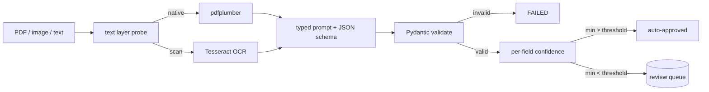

# doc-intelligence — LLM document extraction that fails loudly instead of quietly

[](https://github.com/darrshangovender/doc-intelligence/actions/workflows/tests.yml)
[](LICENSE)
[](https://python.org)
[](https://docs.pydantic.dev)

> Semi-structured documents in, validated records out — or into a review queue. PDF text or OCR, a type-specific extraction prompt bound to a Pydantic schema, per-field confidence scored against the source text, and an auto-approve threshold that routes anything doubtful to a human.

## Scope

This is a **public reference implementation**. The production version at the Agulhas Code client (under NDA) processes their live supplier-document flow and writes into their accounting system. The reference implementation here reproduces the same architecture — the same schema-validated extraction, the same grounding-based confidence scoring, the same review queue — over a synthetic sample corpus anyone can re-run. Volume and accuracy figures from that engagement are not published.

**Why this exists.** Pure OCR plus regex dies on the first layout change. A pure LLM invents values that were never on the page. What survives is the boring middle: constrain the model with a schema, check every extracted value against the source text, and be willing to fail often and visibly. It is cheaper for a bookkeeper to clear thirty exceptions a day than for an auditor to find one wrong invoice three months later.

---

## Quick start

```bash
pip install -e ".[dev]"            # add ".[ocr]" for scanned PDFs, ".[anthropic]" for a real model
python -m eval.run_eval            # 9 golden cases against canned responses, no API key
```

```bash
doc-intel extract demo/sample_docs/invoice_001.txt --type invoice
doc-intel review --status pending
doc-intel show 3
doc-intel approve 3 --reviewer dg
```

```python
from doc_intelligence import Extractor, ReviewQueue, ExtractionStatus

ext = Extractor(provider="anthropic", queue=ReviewQueue("review_queue.db"), review_threshold=0.75)

result = ext.run("demo/sample_docs/invoice_001.txt", doc_type="invoice", enqueue=True)
print(result.status, result.overall_confidence, result.confidence, result.errors)

if result.status is ExtractionStatus.NEEDS_REVIEW:
    q = ReviewQueue("review_queue.db")
    for rec in q.list(status="pending", doc_type="invoice", limit=50):
        q.approve(rec.id, reviewer="dg", corrected_data={**rec.data})

print(Extractor.known_doc_types())    # ['contract', 'invoice', 'receipt']
```

## How it works



1. **Read** the source. Text files pass through; images go to Tesseract; PDFs are probed for a text layer (40+ non-whitespace characters on any page) and take the native or OCR path accordingly.
2. **Prompt** the model with the document text plus the target schema's JSON Schema, instructing it to emit JSON only and to null unknown fields rather than guess.
3. **Parse** the response — direct JSON, then fence-stripping, then a balanced-brace scan. Total failure is `FAILED`, not a guess.
4. **Validate** against the Pydantic schema. Type errors and cross-field validators (invoice totals must reconcile within 0.05) produce `FAILED` with per-error messages.
5. **Score** each field: `0.4 × min(model_confidence, 0.95) + 0.6 × grounding`, where grounding checks whether the extracted value actually appears in the source text.
6. **Gate** on the minimum score across gating fields — nulls and derived fields are excluded.
7. **Route**: auto-approve, or insert a pending row into the SQLite review queue carrying the data, the confidences, and the errors.

## What it extracts

| Extractor | Schema | Validation beyond types |
|---|---|---|
| `InvoiceExtractor` | vendor, invoice_no, dates, line_items, subtotal, tax, total | Line-item sum plus tax must reconcile to the stated total within 0.05 |
| `ReceiptExtractor` | merchant, purchase_date, items, subtotal, tax, total, payment_method, currency | Currency code length bound |
| `ContractExtractor` | parties, effective_date, term, renewal_notice_days, governing_law, contract_type | At least one party; notice days in 0–365; `contract_type` marked derived and excluded from gating |

Adding a fourth is a Pydantic model plus a registry entry — see `docs/extending.md`.

## Design decisions

| Decision | Why |
|---|---|
| **Grounding is 60% of the confidence score** | A model's self-reported confidence is a number it made up. Whether the value it returned actually appears on the page is checkable. Weighting the checkable signal higher is the difference between a threshold that means something and one that doesn't. |
| **`min()` across fields, not mean** | An invoice with nine perfect fields and one wrong total is a wrong invoice. Averaging hides exactly the case the queue exists to catch. |
| **The review queue is the product** | The thing that kills extraction pipelines is a value slightly wrong that nobody catches until the books don't reconcile six weeks later. Exception triage is the cost of correctness, not a failure of the design. |
| **Derived fields are excluded from gating** | `contract_type` is inferred, never quoted on the page, so grounding it is meaningless — it would fail every document. Marking derived fields explicitly keeps the gate honest. |
| **SQLite for the queue** | One file, no service, inspectable with any client while you are figuring out why a document was rejected. |
| **A `StubLLM` with canned responses** | The eval and the whole test suite run with no API key and no bill. |

## Limitations

- **The date rule and the confidence scorer contradict each other.** The prompt requires ISO 8601, and grounding is a substring check against the source. A correctly normalised `2025-03-14` can never match `14 March 2025` on the page, so it falls to a neutral 0.5, is not excluded from gating, and drags the document into review. Correct behaviour is penalised by construction. This is the highest-value bug in the repo.
- **`min()` gating means one weak free-text field pins the whole document.** A vendor name the OCR mangled, or a `governing_law` phrased differently, sends a document with eight exact matches to review.
- **`LineItem.line_total_reconciles` is a dead validator** — it computes the discrepancy and then executes `pass`. Per-line arithmetic errors are calculated and discarded; only the document-level reconciliation actually raises.
- **`except (ValueError, Exception)` swallows every programming error as a JSON parse failure.** `AttributeError`, `TypeError` and `KeyError` from the client or the parser are all reported as `"JSON parse failed"`. Genuine bugs are indistinguishable from malformed model output.
- **The entire eval measures a fixture dictionary, not a model.** `--provider stub` is the default, and the stub's responses are hand-written JSON keyed by document substrings. The reported field accuracy compares two files written by the same author to agree. **No number in this repo reflects LLM extraction quality.**
- **All confidence constants are uncalibrated magic numbers** — the 0.95 substring hit, the 0.5 neutral, the 0.4/0.6 blend, the 0.75 threshold. None is fitted against the nine golden cases, and the eval reports no auto-approve/review confusion matrix that would let you tune them.
- **No retry, timeout, or rate-limit handling on either provider.** A 429 aborts extraction with an unhandled SDK exception rather than routing to the queue — which inverts the entire stated design principle.
- **The OCR path has no preprocessing and no per-page error handling.** Fixed 200 dpi, no deskew, no binarisation, no language hint; one unrenderable page kills the document. The native/OCR decision is a single 40-character threshold evaluated on *any* page, so a 50-page scan with one text-bearing cover page takes the native path and returns almost nothing.
- **The review queue opens a connection per operation** with no WAL and no busy timeout, so two concurrent `doc-intel extract` processes hit `database is locked` immediately. `pending_count` also fetches full rows including source-text blobs, capped at 10,000, to compute a number `SELECT COUNT(*)` would give exactly.
- **There is no document-type classifier.** `doc_type` is a required argument on both the API and the CLI.

## Project layout

```
doc-intelligence/
├── doc_intelligence/
│   ├── facade.py        # Extractor: read → extract → score → route
│   ├── cli.py           # doc-intel extract · review · show · approve · reject
│   ├── ocr.py           # source dispatch by suffix
│   ├── pdf_loader.py    # text-layer probe → pdfplumber or Tesseract
│   ├── llm_client.py    # Anthropic · OpenAI · StubLLM
│   ├── confidence.py    # grounding heuristics, blend, review gate
│   ├── review_queue.py  # SQLite queue: add · list · approve · reject
│   └── extractors/      # base · invoice · receipt · contract
├── eval/                # run_eval.py · fixtures.py · golden_extractions.yml (9 cases)
├── demo/sample_docs/    # 9 synthetic documents
├── tests/               # 64 tests, no API key
└── docs/                # extending · human-review
```

## Tests

```bash
pytest tests/ -q         # 64 tests, fully offline
python -m eval.run_eval  # field accuracy per doc type, against the stub
```

CI runs the suite on every push.

## Author

Darrshan Govender · [Agulhas Code](https://agulhascode.co.za) · Durban, South Africa
